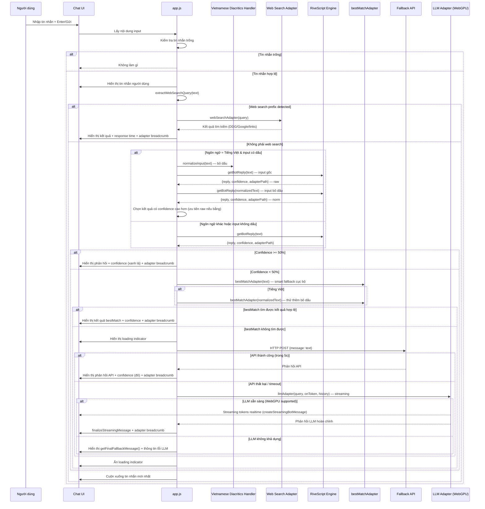
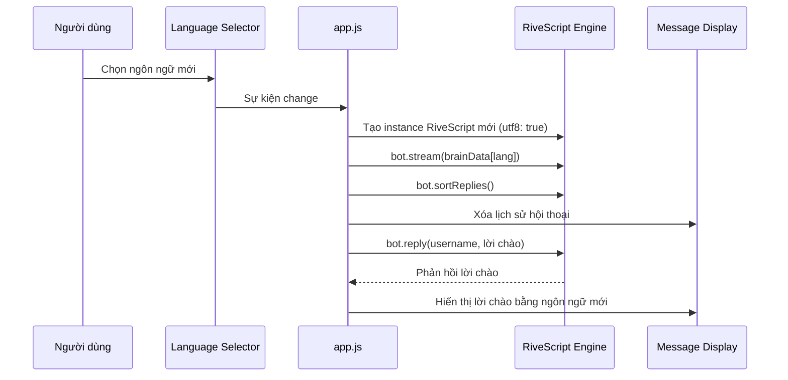

# Tài liệu Thiết kế - Hikari Chatbot

## Tổng quan

Hikari là một chatbot tĩnh chạy hoàn toàn trên trình duyệt, sử dụng thư viện RiveScript (tải qua CDN) để xử lý hội thoại. Ứng dụng được xây dựng bằng HTML, CSS và JavaScript thuần — không cần build tool, bundler hay npm. Chatbot hỗ trợ ba ngôn ngữ: tiếng Việt (mặc định), tiếng Anh và tiếng Nhật.

Thiết kế tập trung vào sự đơn giản: một tệp HTML duy nhất làm điểm vào, một tệp CSS cho giao diện, và các tệp JavaScript riêng biệt cho logic ứng dụng (`app.js`), tải brain data (`brain.js`), và tải dữ liệu JSON (`data-loader.js`). Dữ liệu hội thoại (brain data) được lưu trong các tệp `.rive` riêng biệt theo ngôn ngữ, và dữ liệu cấu hình (specific responses, Q&A dataset, adapter registry, help content) được lưu trong các tệp JSON riêng biệt trong thư mục `data/`. RiveScript được khởi tạo với chế độ UTF-8 để hỗ trợ ký tự tiếng Việt và tiếng Nhật.

Ngoài ra, ứng dụng hỗ trợ hiển thị tỉ lệ khớp (match confidence) cho mỗi phản hồi, tích hợp API fallback khi tỉ lệ khớp thấp, cho phép người dùng xem danh sách các rules và Object Macros hiện có, và cung cấp mẫu rule tùy chỉnh trong brain data để nhà phát triển tham khảo.

Ứng dụng còn tích hợp hệ thống Logic Adapter tương tự ChatterBot (Python), gồm 6 Object Macro được đăng ký qua `bot.setSubroutine()`: best_match (so khớp tương đồng chuỗi), logic_adapter (dispatcher điều phối), mathematical_evaluation (tính toán biểu thức), specific_response (exact match Q&A), time_adapter (thời gian/ngày tháng), và unit_conversion (chuyển đổi đơn vị). Các macro này được gọi từ trigger RiveScript bằng thẻ `<call>`.

Ngoài ra, ứng dụng hỗ trợ xử lý tiếng Việt có dấu (dual-reply strategy), hiển thị chuỗi adapter đã xử lý (adapter path breadcrumb), popup hướng dẫn sử dụng (help dialog) đa ngôn ngữ, cơ chế smart fallback cục bộ qua bestMatchAdapter trước khi gọi API bên ngoài, và wildcard variant triggers cho tiếng Việt để khớp linh hoạt hơn.

Ứng dụng còn tích hợp Web Search Adapter (tìm kiếm web qua DuckDuckGo Instant Answer API), hệ thống tiền xử lý dữ liệu (Preprocessed Data Pipeline) để tối ưu hóa so khớp văn bản với TF-IDF cosine + synset preprocessed, thuật toán tương đồng nâng cao gồm 4 thuật toán (Levenshtein + Jaccard + Cosine + Synset), input normalization nâng cao (loại bỏ dấu câu + modal particles), hiển thị thời gian xử lý (Response Time Display), và URL linkification trong tin nhắn bot.

Phiên bản hiện tại bổ sung thêm: LLM Adapter chạy mô hình ngôn ngữ lớn trực tiếp trên trình duyệt qua WebGPU (Transformers.js, model Qwen3.5-0.8B), lưu trữ lịch sử hội thoại persistent vào IndexedDB, đính kèm ảnh (multimodal), streaming tin nhắn realtime, nút Cancel generate, hiển thị trạng thái tải model, quản lý trạng thái nút gửi, Settings Panel, History Dialog, và fallback chain mở rộng (RiveScript → bestMatch → Fallback API → LLM Adapter → final fallback).

### Quyết định thiết kế chính

| Quyết định | Lựa chọn | Lý do |
|---|---|---|
| CDN cho RiveScript | unpkg (`https://unpkg.com/rivescript@latest/dist/rivescript.min.js`) | CDN chính thức được đề xuất trong tài liệu RiveScript |
| Lưu trữ Brain Data | Tệp `.rive` riêng biệt (`brain/vi.rive`, `brain/en.rive`, `brain/ja.rive`) | Tách dữ liệu khỏi logic, dễ bảo trì và chỉnh sửa |
| Tải Brain Data | `brain.js` — loader sử dụng `fetch()` (browser) hoặc `fs.readFileSync` (Node/test) | Hỗ trợ cả môi trường trình duyệt và test |
| Lưu trữ dữ liệu cấu hình | Tệp JSON riêng biệt trong `data/` | Tách dữ liệu khỏi code, dễ chỉnh sửa mà không cần sửa JS |
| Tải dữ liệu JSON | `data-loader.js` — loader sử dụng `fetch()` (browser) hoặc `fs.readFileSync` (Node/test) | Hỗ trợ cả môi trường trình duyệt và test |
| Node/test data loading | IIFE với `globalThis` thay vì `var` hoisting | Tránh vấn đề `var` hoisting trong trình duyệt khi code chạy ở cả 2 môi trường |
| Chế độ UTF-8 | Bật (`utf8: true`) | Bắt buộc để hỗ trợ ký tự tiếng Việt (dấu) và tiếng Nhật (Hiragana, Katakana, Kanji) |
| Quản lý đa ngôn ngữ | Tạo lại instance RiveScript khi đổi ngôn ngữ | Đảm bảo brain data sạch, tránh xung đột giữa các ngôn ngữ |
| Xử lý tiếng Việt có dấu | Dual-reply strategy: gửi cả input gốc và input bỏ dấu, chọn confidence cao hơn | RiveScript triggers viết không dấu; dual-reply đảm bảo khớp tốt nhất |
| Vietnamese diacritics removal | Bảng ánh xạ thủ công (`VIETNAMESE_DIACRITICS_MAP`) | Không cần thư viện bên ngoài, kiểm soát chính xác mapping |
| Tính toán Match Confidence | So sánh `lastMatch()` với trigger `*` và phân tích loại trigger | RiveScript không có API confidence tích hợp; dùng `lastMatch()` để xác định trigger đã khớp, từ đó tính điểm |
| Smart Fallback | bestMatchAdapter làm fallback cục bộ trước Fallback API | Giảm phụ thuộc vào API bên ngoài, phản hồi nhanh hơn |
| API Fallback | `fetch()` với `AbortController` (timeout 5s) | Sử dụng API trình duyệt chuẩn, không cần thư viện bên ngoài |
| Lấy danh sách triggers | `bot._topics.random` internal data | `getUserTopicTriggers()` trả về object không phải array; đọc trực tiếp internal data đáng tin cậy hơn |
| Object Macro Registration | `bot.setSubroutine(name, fn)` | API chính thức của RiveScript JS để đăng ký subroutine từ JavaScript |
| Text Similarity | Levenshtein distance + Jaccard similarity + Cosine similarity + Synset similarity tự triển khai | 4 thuật toán kết hợp (25% mỗi thuật toán) cho kết quả chính xác hơn, không cần thư viện bên ngoài |
| Preprocessed Data | Build script `scripts/preprocess.js` tạo `data/preprocessed.json` | Tiền xử lý TF-IDF vectors, synonym groups, magnitudes giúp so khớp nhanh hơn tại runtime |
| Preprocessed Data Loading | Browser: fetch + localStorage cache (version-based invalidation); Node: fs.readFileSync | Tối ưu tốc độ tải lại, tự động cập nhật khi version thay đổi |
| Web Search | DuckDuckGo Instant Answer API (chính) + Google Custom Search API (tùy chọn) | DDG miễn phí, hỗ trợ CORS, không cần API key; Google là tùy chọn nâng cao |
| Web Search Detection | `extractWebSearchQuery()` trong `sendMessage()` thay vì RiveScript `<call>` | RiveScript subroutine không hỗ trợ async/Promise; xử lý trực tiếp trong JS |
| Input Normalization | Full preprocessing: lowercase → diacritics → punctuation → modal particles | Cải thiện trigger matching bằng cách loại bỏ nhiễu từ input |
| URL Linkification | `linkifyText()` với HTML escape + regex URL detection | An toàn (escape XSS), hiển thị link tìm kiếm nhấp được |
| Response Time | Đo `performance.now()` hoặc `Date.now()` từ start đến result | Hiển thị tốc độ xử lý cho người dùng |
| Safe Math Evaluation | Parser tự viết (regex + switch/case) | Tránh `eval()` để đảm bảo an toàn, chỉ hỗ trợ 4 phép tính cơ bản |
| Adapter Dispatcher | Priority-based selection | Chọn phản hồi từ adapter có độ ưu tiên cao nhất trả về kết quả hợp lệ |
| Adapter Path Tracking | Biến toàn cục `_adapterPath` (mảng) | Đơn giản, không cần dependency injection; mỗi adapter push tên vào mảng |
| Help Dialog | Modal overlay với nội dung từ JSON | Tách nội dung khỏi code, hỗ trợ đa ngôn ngữ dễ dàng |
| Favicon | Inline SVG trong `<link rel="icon">` | Tránh lỗi 404, không cần tệp favicon riêng |
| LLM Adapter | Transformers.js (`@huggingface/transformers`) qua CDN, model Qwen3.5-0.8B-ONNX-OPT, device webgpu | Chạy LLM hoàn toàn trên trình duyệt, không cần backend; WebGPU cho hiệu năng tốt nhất |
| Retention Policy | 2 cơ chế: `"count"` (FIFO, giới hạn N hội thoại) và `"days"` (giới hạn M ngày); config lưu localStorage | Cho phép người dùng kiểm soát dung lượng IndexedDB; FIFO đơn giản và dễ hiểu |
| Adapter Enable/Disable | Toggle per-adapter qua checkbox trong Macros Panel; trạng thái lưu localStorage; đọc động từ `adapter-registry.json` | Không hard-code danh sách adapter; người dùng tùy chỉnh được bộ adapter đang hoạt động |
| Adapter Prefix Command | Detect `/[key]` prefix trong `sendMessage()`, gọi adapter trực tiếp | Đơn giản, không cần UI phức tạp; tương tự slash commands trong Discord/Slack |
| LLM Model Loading | Lazy load — chỉ load khi cần lần đầu, singleton state | Tránh tải model không cần thiết; model lớn (~500MB) chỉ tải 1 lần |
| LLM Thinking Mode | Prefix `<think>\n` trong prompt khi bật | Kích hoạt chain-of-thought của Qwen3.5; tắt mặc định để tiết kiệm token |
| LLM Streaming | `TextStreamer` với `callback_function` tích lũy token | Hiển thị phản hồi realtime, cải thiện UX khi LLM generate chậm |
| LLM Cancel | `InterruptableStoppingCriteria.interrupt()` | API chính thức của Transformers.js để dừng generate an toàn |
| LLM Memory Management | Dispose `past_key_values` sau mỗi generate | Giải phóng bộ nhớ GPU, tránh memory leak khi generate nhiều lần |
| Chat History Storage | Session: `_chatHistory` array; Persistent: IndexedDB qua `data/chat-history-db.js` | Session cho LLM context; IndexedDB cho persistence qua reload |
| Chat History Limit | `setChatHistoryMaxTurns(n)` giới hạn số turn gửi cho LLM | Tránh context window overflow; người dùng kiểm soát được |
| File Attachment | FileReader API → data URL → gửi cho `llmGenerateWithImage()` | Không cần upload server; data URL truyền trực tiếp cho LLM |
| Streaming UI | Tạo element trống, cập nhật innerHTML realtime, finalize khi xong | Hiển thị token ngay khi có, không cần buffer toàn bộ response |
| Thinking Block UI | Tách `<think>...</think>` thành block riêng với CSS collapsible | Hiển thị quá trình suy nghĩ tách biệt với câu trả lời cuối |
| Fallback Chain | RiveScript → bestMatch → Fallback API → LLM Adapter → final fallback | LLM là fallback cuối cùng vì tốn tài nguyên nhất; đảm bảo luôn có phản hồi |
| Settings Panel | Toggle/input trong panel ẩn, toggle qua `toggleSettingsPanel()` | Giao diện đơn giản, không cần modal; cài đặt ít nên không cần trang riêng |
| History Dialog | Modal overlay với 2 tab (IndexedDB/Session) + pagination | Tách biệt 2 nguồn dữ liệu; pagination tránh render quá nhiều DOM |
| IndexedDB Schema | Object store `messages` với index `timestamp` | Index timestamp cho phép query theo thứ tự thời gian hiệu quả |
| llm_adapter Display Name | Thêm vào `ADAPTER_DISPLAY_NAMES` | Breadcrumb hiển thị "LLM Adapter" khi LLM xử lý tin nhắn |

## Kiến trúc

Ứng dụng theo mô hình client-side đơn giản, không có backend:

```mermaid
graph TD
    A[index.html] -->|tải| B[style.css]
    A -->|tải| C[app.js]
    A -->|tải| C2[brain.js — Brain Loader]
    A -->|tải| C3[data-loader.js — Data Loader]
    A -->|tải CDN| D[rivescript.min.js]
    C2 -->|fetch .rive files| G[brain/ — vi.rive, en.rive, ja.rive]
    C3 -->|fetch JSON files| G2[data/ — specific-responses, qa-dataset, adapter-registry, help-content]
    C -->|khởi tạo| E[RiveScript Engine]
    C -->|quản lý| F[Chat UI Controller]
    F -->|hiển thị| H[Message Display]
    F -->|nhận input| I[Message Input]
    F -->|chuyển ngôn ngữ| J[Language Selector]
    F -->|hiển thị| K[Rules List Panel]
    F -->|hiển thị| K2[Object Macro List Panel]
    F -->|hiển thị| K3[Help Dialog — Modal Overlay]
    E -->|xử lý tin nhắn| F
    C -->|tính toán| L[Confidence Calculator]
    L -->|lastMatch| E
    L -->|quyết định fallback| L2[Smart Fallback]
    L2 -->|thử cục bộ| P[best_match]
    L2 -->|nếu thất bại| M[Fallback API Client]
    M -->|HTTP POST| N[External API Server]
    C -->|đăng ký| O[Logic Adapter System]
    O -->|setSubroutine| E
    O -->|chứa| P
    O -->|chứa| Q[logic_adapter - Dispatcher]
    O -->|chứa| R[mathematical_evaluation]
    O -->|chứa| S[specific_response]
    O -->|chứa| T[time_adapter]
    O -->|chứa| U[unit_conversion]
    O -->|chứa| U2[web_search]
    Q -->|điều phối| P
    Q -->|điều phối| R
    Q -->|điều phối| S
    Q -->|điều phối| T
    Q -->|điều phối| U
    C -->|quản lý| V[Adapter Registry]
    V -->|cung cấp metadata| K2
    C -->|theo dõi| W[Adapter Path Tracking]
    W -->|breadcrumb| H
    C -->|normalize| X[Vietnamese Diacritics Handler]
    X -->|dual-reply| E
    C -->|detect web search| Y[Web Search Detection]
    Y -->|extractWebSearchQuery| U2
    U2 -->|DDG API| Z1[DuckDuckGo Instant Answer API]
    U2 -->|Google API| Z2[Google Custom Search API]
    U2 -->|fallback links| Z3[Search Links — Google + DDG + Bing]
    C -->|load| PP[Preprocessed Data Pipeline]
    PP -->|TF-IDF + synset| P
    C -->|linkify| LF[URL Linkification]
    LF -->|clickable links| H
    C -->|fallback cuối| LA[LLM Adapter — adapters/llm-adapter.js]
    LA -->|WebGPU| LM[Transformers.js — Qwen3.5-0.8B]
    LA -->|streaming tokens| H
    C -->|lưu history| IDB[IndexedDB — data/chat-history-db.js]
    C -->|load history| IDB
    C -->|attach image| FA[File Attachment — FileReader API]
    FA -->|imageDataURL| LA
    C -->|settings| SP[Settings Panel — thinking/history toggles]
    C -->|history dialog| HD[History Dialog — 2 tabs + pagination]
    HD -->|query| IDB
```



### Luồng xử lý tin nhắn



### Luồng chuyển ngôn ngữ



## Thành phần và Giao diện

### 1. `index.html` — Điểm vào ứng dụng

Cấu trúc HTML chính:

```html
<!DOCTYPE html>
<html lang="vi">
<head>
    <meta charset="UTF-8">
    <meta name="viewport" content="width=device-width, initial-scale=1.0">
    <title>Hikari Chatbot</title>
    <link rel="icon" href="data:image/svg+xml,<svg xmlns='http://www.w3.org/2000/svg' viewBox='0 0 100 100'><text y='.9em' font-size='90'>🌟</text></svg>">
    <link rel="stylesheet" href="style.css">
</head>
<body>
    <div class="chat-container">
        <header class="chat-header">
            <h1>Hikari</h1>
            <div class="header-controls">
                <button id="help-button" title="Hướng dẫn sử dụng">❓</button>
                <button id="rules-button" title="Xem danh sách rules">📋</button>
                <button id="macros-button" title="Xem danh sách Object Macros">🔧</button>
                <select id="language-selector">
                    <option value="vi" selected>Tiếng Việt</option>
                    <option value="en">English</option>
                    <option value="ja">日本語</option>
                </select>
            </div>
        </header>
        <!-- Rules Panel, Macros Panel, Message Display, Input Area -->
        ...
    </div>
    <!-- Help Dialog — Modal Overlay -->
    <div id="help-overlay" class="help-overlay hidden" role="dialog" aria-modal="true">
        <div class="help-dialog">
            <div class="help-dialog-header">
                <h2 id="help-dialog-title">📖 Hướng dẫn sử dụng</h2>
                <button id="help-close-button" class="help-close-button">&times;</button>
            </div>
            <div id="help-dialog-body" class="help-dialog-body"></div>
        </div>
    </div>
    <script src="https://unpkg.com/rivescript@latest/dist/rivescript.min.js"></script>
    <script src="brain.js"></script>
    <script src="data-loader.js"></script>
    <script src="app.js"></script>
</body>
</html>
```

### 2. `app.js` — Logic ứng dụng

Module chính chứa toàn bộ logic, không chứa dữ liệu inline (dữ liệu được tải từ `brain.js` và `data-loader.js`).

### 2.1 `brain.js` — Brain Loader

Module tải nội dung các tệp `.rive` từ thư mục `brain/`:

| Hàm | Mô tả | Tham số | Trả về |
|---|---|---|---|
| `loadBrainFile(lang)` | Tải nội dung tệp `.rive` cho một ngôn ngữ qua `fetch()` | `lang: string` | `Promise<string>` |
| `loadAllBrains()` | Tải tất cả brain files cho 3 ngôn ngữ | — | `Promise<void>` |

Biến toàn cục: `BRAIN_DATA` (object với key vi/en/ja), `BRAIN_FILES` (ánh xạ lang → file path).

### 2.2 `data-loader.js` — Data Loader

Module tải các tệp JSON dữ liệu từ thư mục `data/`:

| Hàm | Mô tả | Tham số | Trả về |
|---|---|---|---|
| `loadAllData()` | Tải tất cả tệp JSON dữ liệu qua `fetch()` | — | `Promise<void>` |

Biến toàn cục được populate: `SPECIFIC_RESPONSES`, `QA_DATASET`, `ADAPTER_REGISTRY`, `HELP_CONTENT`.

### 2.3 Giao diện các hàm chính (`app.js`)

| Hàm | Mô tả | Tham số | Trả về |
|---|---|---|---|
| `initBot(lang)` | Khởi tạo RiveScript engine với brain data của ngôn ngữ chỉ định | `lang: string` ("vi", "en", "ja") | `Promise<void>` |
| `sendMessage()` | Lấy tin nhắn từ input, áp dụng dual-reply (tiếng Việt), smart fallback, hiển thị kết quả | — | `Promise<void>` |
| `getBotReply(inputText)` | Gửi input đến bot, trả về reply + confidence + adapterPath | `inputText: string` | `Promise<{reply, confidence, adapterPath}>` |
| `appendMessage(text, sender, confidence, adapterPath, responseTime)` | Thêm tin nhắn vào message display, kèm confidence, adapter breadcrumb, và response time nếu là bot | `text: string`, `sender: "user" \| "bot"`, `confidence?: number`, `adapterPath?: string[]`, `responseTime?: number` | `void` |
| `scrollToBottom()` | Cuộn message display xuống cuối | — | `void` |
| `changeLanguage(lang)` | Đổi ngôn ngữ: tạo lại bot, xóa chat, cập nhật rules list, hiển thị lời chào mới | `lang: string` | `Promise<void>` |
| `validateMessage(text)` | Kiểm tra tin nhắn có hợp lệ (không trống/chỉ khoảng trắng) | `text: string` | `boolean` |
| `removeVietnameseDiacritics(str)` | Loại bỏ dấu tiếng Việt khỏi chuỗi | `str: string` | `string` |
| `normalizeInput(text)` | Normalize input: lowercase, bỏ dấu (vi), bỏ dấu câu (giữ +-*/), bỏ modal particles cuối câu | `text: string` | `string` |
| `showError(message)` | Hiển thị thông báo lỗi trong chat | `message: string` | `void` |
| `calculateConfidence(matchedTrigger)` | Tính tỉ lệ khớp dựa trên trigger đã match | `matchedTrigger: string` | `number` (0–100) |
| `getConfidenceClass(confidence)` | Trả về CSS class cho màu sắc confidence | `confidence: number` | `string` ("confidence-high" \| "confidence-low") |
| `getAdapterDisplayName(adapterKey)` | Lấy tên hiển thị adapter theo ngôn ngữ hiện tại | `adapterKey: string` | `string` |
| `callFallbackAPI(userMessage)` | Gửi HTTP POST đến Fallback API với timeout 5s | `userMessage: string` | `Promise<string \| null>` |
| `showLoadingIndicator()` | Hiển thị chỉ báo đang tải trong message display | — | `HTMLElement` |
| `hideLoadingIndicator(element)` | Ẩn/xóa chỉ báo đang tải | `element: HTMLElement` | `void` |
| `toggleRulesPanel()` | Bật/tắt hiển thị panel danh sách rules | — | `void` |
| `updateRulesList(lang)` | Cập nhật danh sách triggers từ `bot._topics.random`, với deduplication và lọc wildcard | `lang: string` | `void` |
| `formatTrigger(trigger)` | Chuyển trigger RiveScript thành dạng dễ đọc | `trigger: string` | `string` |
| `toggleMacrosPanel()` | Bật/tắt hiển thị panel danh sách Object Macros | — | `void` |
| `updateMacrosList(lang)` | Cập nhật danh sách Object Macros cho ngôn ngữ chỉ định, đọc động từ ADAPTER_REGISTRY, render toggle per-adapter | `lang: string` | `void` |
| `renderHelpContent()` | Render nội dung help dialog theo ngôn ngữ hiện tại từ HELP_CONTENT | — | `void` |
| `openHelpDialog()` | Mở help dialog (render content + remove hidden class) | — | `void` |
| `closeHelpDialog()` | Đóng help dialog (add hidden class) | — | `void` |
| `registerAdapters(bot, lang)` | Đăng ký tất cả 7 adapter vào RiveScript engine qua `setSubroutine()` | `bot: RiveScript`, `lang: string` | `void` |
| `levenshteinDistance(a, b)` | Tính khoảng cách Levenshtein giữa hai chuỗi | `a: string`, `b: string` | `number` |
| `jaccardSimilarity(a, b)` | Tính độ tương đồng Jaccard giữa hai chuỗi (dựa trên tập từ) | `a: string`, `b: string` | `number` (0–1) |
| `textSimilarity(a, b)` | Tính độ tương đồng tổng hợp (kết hợp Levenshtein + Jaccard + Cosine + Synset, 25% mỗi thuật toán) | `a: string`, `b: string` | `number` (0–1) |
| `bestMatchAdapter(rs, args)` | Object Macro: tìm câu trả lời phù hợp nhất từ Q&A dataset, ưu tiên preprocessed data | `rs: RiveScript`, `args: string[]` | `string` |
| `logicAdapterDispatcher(rs, args)` | Object Macro: dispatcher điều phối các adapter con theo ưu tiên, dọn dẹp adapter path | `rs: RiveScript`, `args: string[]` | `string` |
| `isValidAdapterResult(result)` | Kiểm tra kết quả adapter có hợp lệ (không phải thông báo lỗi/không tìm thấy) | `result: string` | `boolean` |
| `mathematicalEvaluationAdapter(rs, args)` | Object Macro: tính toán biểu thức toán học an toàn | `rs: RiveScript`, `args: string[]` | `string` |
| `specificResponseAdapter(rs, args)` | Object Macro: trả về phản hồi exact match, hỗ trợ diacritics-stripped match cho tiếng Việt | `rs: RiveScript`, `args: string[]` | `string` |
| `timeAdapter(rs, args)` | Object Macro: trả lời câu hỏi về thời gian/ngày tháng/thứ | `rs: RiveScript`, `args: string[]` | `string` |
| `unitConversionAdapter(rs, args)` | Object Macro: chuyển đổi đơn vị đo lường | `rs: RiveScript`, `args: string[]` | `string` |
| `parseMathExpression(input, lang)` | Trích xuất và tính toán biểu thức toán học từ chuỗi đầu vào | `input: string`, `lang: string` | `{result: number} \| {error: string}` |
| `parseConversionRequest(input, lang)` | Phân tích cú pháp yêu cầu chuyển đổi đơn vị | `input: string`, `lang: string` | `{value: number, from: string, to: string} \| null` |
| `convertUnit(value, fromUnit, toUnit)` | Thực hiện chuyển đổi đơn vị | `value: number`, `fromUnit: string`, `toUnit: string` | `number \| null` |
| `extractWebSearchQuery(text)` | Detect nếu input là web search command, trả về query string hoặc null | `text: string` | `string \| null` |
| `linkifyText(text)` | Chuyển đổi URL trong text thành thẻ `<a>` nhấp được, escape HTML, newline → `<br>` | `text: string` | `string` (HTML) |
| `webSearchAdapter(rs, args)` | Object Macro: tìm kiếm web qua DDG/Google, trả về kết quả hoặc link tìm kiếm | `rs: RiveScript`, `args: string[]` | `Promise<string>` |
| `duckDuckGoSearch(query)` | Gọi DuckDuckGo Instant Answer API, trả về kết quả hoặc null | `query: string` | `Promise<object \| null>` |
| `googleSearch(query, numResults)` | Gọi Google Custom Search API (cần key), trả về kết quả hoặc null | `query: string`, `numResults?: number` | `Promise<array \| null>` |
| `formatDDGResults(results, query, lang)` | Format kết quả DDG thành chuỗi hiển thị | `results: object`, `query: string`, `lang: string` | `string` |
| `formatSearchLinks(query, lang)` | Format link tìm kiếm (Google + DDG + Bing) | `query: string`, `lang: string` | `string` |
| `cosineSimilarity(a, b)` | Tính Cosine Similarity dựa trên TF vector | `a: string`, `b: string` | `number` (0–1) |
| `cosineSimilarityTFIDF(inputTFIDF, inputMag, corpusTFIDF, corpusMag)` | Cosine similarity sử dụng TF-IDF vectors preprocessed | `inputTFIDF: object`, `inputMag: number`, `corpusTFIDF: object`, `corpusMag: number` | `number` (0–1) |
| `synsetSimilarity(a, b)` | Tính Synset Similarity dựa trên SYNONYM_GROUPS | `a: string`, `b: string` | `number` (0–1) |
| `synsetSimilarityPreprocessed(inputGroups, corpusGroups)` | Synset similarity sử dụng preprocessed synonym group indices | `inputGroups: number[]`, `corpusGroups: number[]` | `number` (0–1) |
| `areSynonyms(wordA, wordB)` | Kiểm tra hai từ có thuộc cùng nhóm đồng nghĩa | `wordA: string`, `wordB: string` | `boolean` |
| `loadPreprocessedData()` | Tải preprocessed data từ file (Node) hoặc fetch + localStorage (browser) | — | `Promise<void>` |
| `findBestMatchPreprocessed(input, lang, threshold)` | Tìm câu trả lời phù hợp nhất từ preprocessed data (TF-IDF cosine + synset) | `input: string`, `lang: string`, `threshold?: number` | `{answer: string, score: number} \| null` |
| `tokenizeForSimilarity(text, lang)` | Tokenize input: lowercase, bỏ dấu (vi), bỏ punctuation, tách từ | `text: string`, `lang: string` | `string[]` |
| `initializeApp()` | Hàm khởi tạo chính: load brains, load data, load preprocessed data, init bot, gắn event listeners (bao gồm help dialog) | — | `Promise<void>` |

#### Các hàm mới (LLM Adapter, Chat History, File Attachment, Streaming, UI)

| Hàm | Mô tả | Tham số | Trả về |
|---|---|---|---|
| `addChatHistory(role, content)` | Thêm một turn vào `_chatHistory` session và lưu vào IndexedDB nếu history enabled | `role: string`, `content: string` | `void` |
| `getChatHistoryForLLM()` | Lấy lịch sử hội thoại đã trim theo `maxTurns` để gửi cho LLM | — | `Array<{role, content}>` |
| `clearChatHistory()` | Xóa `_chatHistory` session trong bộ nhớ | — | `void` |
| `setChatHistoryEnabled(bool)` | Bật/tắt tính năng lưu chat history | `bool: boolean` | `void` |
| `isChatHistoryEnabled()` | Kiểm tra chat history có đang bật không | — | `boolean` |
| `setChatHistoryMaxTurns(n)` | Đặt số turn tối đa gửi cho LLM | `n: number` | `void` |
| `getChatHistoryMaxTurns()` | Lấy số turn tối đa hiện tại | — | `number` |
| `loadRecentHistoryToChat()` | Tải 10 tin nhắn gần nhất từ IndexedDB và hiển thị vào chat khi khởi động | — | `Promise<void>` |
| `handleFileAttachment(file)` | Xử lý file ảnh được chọn: đọc data URL, hiển thị preview | `file: File` | `void` |
| `clearAttachment()` | Xóa ảnh đính kèm hiện tại và ẩn preview | — | `void` |
| `consumeAttachment()` | Lấy data URL ảnh đính kèm hiện tại và xóa nó | — | `string \| null` |
| `createStreamingBotMessage()` | Tạo element tin nhắn bot trống với class `.streaming` để cập nhật realtime | — | `HTMLElement` |
| `createStreamingCallback(element)` | Tạo callback nhận token từ LLM, cập nhật nội dung element realtime, tách thinking block | `element: HTMLElement` | `function(accumulatedText): void` |
| `finalizeStreamingMessage(element, finalText, confidence, adapterPath, responseTime)` | Finalize tin nhắn streaming: xóa class `.streaming`, thêm confidence/breadcrumb/time | `element: HTMLElement`, `finalText: string`, `confidence?: number`, `adapterPath?: string[]`, `responseTime?: number` | `void` |
| `removeStreamingMessage(element)` | Xóa element tin nhắn streaming khỏi DOM (khi cancel) | `element: HTMLElement` | `void` |
| `showLLMCancelButton()` | Hiển thị nút Cancel LLM generate | — | `void` |
| `hideLLMCancelButton()` | Ẩn nút Cancel LLM generate | — | `void` |
| `showLLMLoadingStatus(message)` | Hiển thị trạng thái loading model LLM trong message display | `message: string` | `void` |
| `hideLLMLoadingStatus()` | Ẩn trạng thái loading model LLM | — | `void` |
| `onLLMStatusChange(action, message)` | Callback nhận thông báo trạng thái từ LLM Adapter, cập nhật UI | `action: string`, `message: string` | `void` |
| `setSendingDisabled()` | Vô hiệu hóa nút gửi và input khi đang xử lý | — | `void` |
| `setSendingEnabled()` | Kích hoạt lại nút gửi và input sau khi xử lý xong | — | `void` |
| `toggleSettingsPanel()` | Bật/tắt hiển thị Settings Panel | — | `void` |
| `openHistoryDialog()` | Mở History Dialog, load dữ liệu từ IndexedDB | — | `Promise<void>` |
| `closeHistoryDialog()` | Đóng History Dialog | — | `void` |
| `clearAllHistory()` | Xóa toàn bộ lịch sử: IndexedDB + session | — | `Promise<void>` |
| `getFinalFallbackMessage()` | Tạo thông báo fallback cuối cùng đa ngôn ngữ kèm thông tin lỗi LLM | — | `string` |
| `applyRetentionPolicy(mode, value)` | Áp dụng chính sách giới hạn lưu trữ: mode="count" xóa messages cũ nhất cho đến khi còn ≤ value; mode="days" xóa messages có timestamp < Date.now() - value*86400000 | `mode: "count"\|"days"`, `value: number` | `Promise<void>` |
| `getRetentionConfig()` | Đọc config retention từ localStorage, trả về default nếu chưa có | — | `{mode: string, value: number}` |
| `setRetentionConfig(mode, value)` | Lưu config retention vào localStorage và gọi applyRetentionPolicy() ngay | `mode: string`, `value: number` | `Promise<void>` |
| `setAdapterActive(adapterKey, isActive)` | Cập nhật ADAPTER_REGISTRY[adapterKey].active và lưu trạng thái vào localStorage | `adapterKey: string`, `isActive: boolean` | `void` |
| `getAdapterStates()` | Đọc trạng thái adapter từ localStorage (key: hikari_adapter_states) | — | `{[key: string]: boolean}` |
| `saveAdapterStates()` | Lưu active states của tất cả adapter trong ADAPTER_REGISTRY vào localStorage | — | `void` |
| `parseAdapterPrefixCommand(input)` | Parse input để detect `/[key] content` pattern, kiểm tra key trong ADAPTER_REGISTRY với active:true và không phải voice-adapter | `input: string` | `{adapterKey: string, content: string} \| null` |
| `showAdapterPrefixBadge(adapterKey)` | Hiển thị badge/chip phía trên Message_Input với tên adapter đã chọn | `adapterKey: string` | `void` |
| `hideAdapterPrefixBadge()` | Ẩn badge/chip khi prefix không còn hợp lệ | — | `void` |

#### Brain Data

Dữ liệu hội thoại được lưu trong các tệp `.rive` riêng biệt, tải qua `brain.js`:

```
brain/vi.rive  — Tiếng Việt (bao gồm wildcard variant triggers)
brain/en.rive  — Tiếng Anh
brain/ja.rive  — Tiếng Nhật
```

Mỗi tệp `.rive` chứa: mẫu chào hỏi, hỏi tên, khả năng, tạm biệt, mặc định (`+ *`), custom rules (thời tiết, trò chơi), trigger gọi `<call>` cho các adapter, và wildcard variant triggers (tất cả 3 ngôn ngữ). Brain .rive files có fallback triggers cho web search prefixes ("google *", "tra cuu *", "グーグル *") gọi `<call>best_match</call>` trong trường hợp `sendMessage()` detection bỏ sót.

#### Dữ liệu cấu hình (JSON)

Dữ liệu cấu hình được lưu trong các tệp JSON riêng biệt, tải qua `data-loader.js`:

```
data/specific-responses.json  — Bảng ánh xạ câu hỏi-trả lời exact match (3 ngôn ngữ)
data/qa-dataset.json          — Tập dữ liệu Q&A cho Best Match Adapter (3 ngôn ngữ)
data/adapter-registry.json    — Metadata adapter (tên, mô tả, callSyntax, active) — bao gồm web_search
data/help-content.json        — Nội dung help dialog (3 ngôn ngữ, sections + items)
data/preprocessed.json        — Dữ liệu tiền xử lý (tokens, TF, TF-IDF, IDF, synGroups, magnitudes)
```

### 3. `style.css` — Giao diện

Các thành phần CSS chính:

| Selector | Mục đích |
|---|---|
| `.chat-container` | Container chính, căn giữa, max-width cho desktop |
| `.chat-header` | Header chứa tên Hikari, help button, và language selector |
| `.message-display` | Khu vực hiển thị tin nhắn, overflow-y: auto |
| `.message` | Tin nhắn chung |
| `.message.user` | Tin nhắn người dùng — căn phải, màu nền khác |
| `.message.bot` | Tin nhắn Hikari — căn trái, màu nền khác |
| `.confidence` | Hiển thị tỉ lệ khớp, font-size nhỏ hơn nội dung |
| `.confidence-high` | Confidence ≥ 50% — màu xanh lá |
| `.confidence-low` | Confidence < 50% — màu đỏ |
| `.adapter-path` | Breadcrumb adapter path — font nhỏ, in nghiêng, màu xám |
| `.loading-indicator` | Chỉ báo đang tải khi chờ Fallback API |
| `.macros-panel` | Panel hiển thị danh sách Object Macros |
| `.macro-item` | Mỗi Object Macro trong danh sách |
| `.macro-call-syntax` | Cú pháp `<call>` hiển thị dạng code |
| `.input-area` | Khu vực nhập tin nhắn + nút gửi |
| `.response-time` | Hiển thị thời gian xử lý (⏱ Xms), font nhỏ, màu xám |
| `.message.bot a` | Link nhấp được trong tin nhắn bot, màu sắc phù hợp, hiệu ứng hover |
| `.help-overlay` | Overlay nền mờ cho help dialog, fade-in animation |
| `.help-dialog` | Dialog container, slide-up animation, max-height 80vh |
| `.help-dialog-header` | Header dialog với nút đóng |
| `.help-dialog-body` | Nội dung dialog, overflow-y: auto |
| `.help-section` | Mỗi phần trong help dialog |
| `.help-example` | Ví dụ lệnh trong help dialog, dạng code |
| `.help-dot` | Chấm tròn minh họa màu confidence (green/red) |
| `@media (max-width: 768px)` | Responsive cho thiết bị di động |

#### CSS mới (LLM, Streaming, History, Settings)

| Selector | Mục đích |
|---|---|
| `.streaming` | Tin nhắn bot đang được LLM generate realtime |
| `.llm-thinking-block` | Container cho thinking block `<think>...</think>` |
| `.llm-thinking-label` | Label "Đang suy nghĩ..." cho thinking block |
| `.llm-thinking-content` | Nội dung thinking, có thể collapsible |
| `.llm-cancel-container` | Container cho nút Cancel LLM generate |
| `.llm-cancel-button` | Nút Cancel LLM generate |
| `.llm-loading-status` | Hiển thị trạng thái loading model LLM |
| `.disabled` | Trạng thái vô hiệu hóa cho nút gửi và input |
| `.message-image` | Ảnh đính kèm trong tin nhắn user (max-width, border-radius) |
| `.macro-item.disabled` | Adapter bị tắt trong Macros Panel — opacity thấp (0.5), pointer-events: none cho nội dung (không phải toggle) |
| `.adapter-prefix-badge` | Badge/chip hiển thị phía trên input khi prefix command hợp lệ được nhận diện, màu nền phân biệt, icon 🔧 |

## Mô hình Dữ liệu

### Trạng thái ứng dụng

Ứng dụng quản lý trạng thái đơn giản trong bộ nhớ (không persist):

```javascript
// Trạng thái toàn cục
let bot = null;              // Instance RiveScript hiện tại
let currentLang = 'vi';      // Ngôn ngữ hiện tại
const USERNAME = 'local-user'; // Username cố định cho RiveScript
var _adapterPath = [];       // Tracking adapter chain cho mỗi lượt phản hồi

// Chat History
var _chatHistory = [];           // Lịch sử hội thoại session [{role, content}]
var _chatHistoryEnabled = true;  // Bật/tắt lưu history
var _chatHistoryMaxTurns = 10;   // Số turn tối đa gửi cho LLM

// File Attachment
var _attachmentDataURL = null;   // Data URL ảnh đính kèm hiện tại
```

### Cấu trúc Brain Data (RiveScript syntax)

Mỗi ngôn ngữ có 5 nhóm mẫu:

| Nhóm | Trigger mẫu (tiếng Việt) | Mô tả |
|---|---|---|
| Chào hỏi | `+ xin chao`, `+ chao ban` | Lời chào |
| Hỏi tên | `+ ban ten gi`, `+ ten ban la gi` | Hỏi tên bot |
| Khả năng | `+ ban co the lam gi` | Hỏi bot làm được gì |
| Tạm biệt | `+ tam biet`, `+ bye` | Lời tạm biệt |
| Mặc định | `+ *` | Phản hồi khi không nhận diện được |

### Cấu trúc tin nhắn hiển thị

Mỗi tin nhắn trong DOM có cấu trúc:

```html
<div class="message user">
    <span class="message-text">Nội dung tin nhắn</span>
</div>
<div class="message bot">
    <span class="message-text">Phản hồi từ Hikari</span>
    <span class="confidence confidence-high">Confidence: 85%</span>
    <span class="adapter-path">RiveScript</span>
    <span class="response-time">⏱ 12ms</span>
</div>
```

### Adapter Registry (Metadata)

Mỗi adapter trong `ADAPTER_REGISTRY` có cấu trúc:

```javascript
{
    name: { vi: string, en: string, ja: string },       // Tên hiển thị theo ngôn ngữ
    description: { vi: string, en: string, ja: string }, // Mô tả theo ngôn ngữ
    callSyntax: string,                                   // Cú pháp gọi từ trigger
    active: boolean                                       // Trạng thái hoạt động
}
```

### Retention Config (localStorage)

Config giới hạn lưu trữ lịch sử chat, lưu tại key `hikari_retention_config`:

```javascript
{
    mode: "count" | "days",  // Chế độ giới hạn
    value: number            // N (số hội thoại) hoặc M (số ngày)
}
// Mặc định: { mode: "count", value: 50 }
```

### Adapter States (localStorage)

Trạng thái enable/disable của từng adapter, lưu tại key `hikari_adapter_states`:

```javascript
{
    [adapterKey: string]: boolean  // true = enabled, false = disabled
}
// Ví dụ: { "best_match": true, "web_search": false, "llm_adapter": true }
// voice-adapter không có trong object này (luôn enabled)
```

### Adapter Prefix Command

Format lệnh prefix để chỉ định adapter trực tiếp:

```javascript
// Adapter Prefix Command format
// Input: "/best_match xin chào"
// Parsed: { adapterKey: "best_match", content: "xin chào" }
// Regex: /^\/([a-z_]+)\s+(.+)$/
```

### Q&A Dataset (Best Match Adapter)

Mỗi cặp Q&A trong `QA_DATASET[lang]`:

```javascript
{ q: string, a: string }  // q = câu hỏi, a = câu trả lời
```

### Specific Response Mapping

Bảng ánh xạ `SPECIFIC_RESPONSES[lang]`:

```javascript
{ [question: string]: string }  // key = câu hỏi (lowercase), value = câu trả lời
```

### Conversion Factors

Hệ số chuyển đổi `CONVERSION_FACTORS`:

```javascript
{
    length: { [unit: string]: number },  // Hệ số quy đổi về mét (m)
    mass: { [unit: string]: number }     // Hệ số quy đổi về kilogram (kg)
    // Nhiệt độ: xử lý bằng công thức riêng (C↔F↔K)
}
```

### Logic Adapter Priority

Thứ tự ưu tiên của các adapter (cao → thấp):

| Ưu tiên | Adapter | Lý do |
|---|---|---|
| 1 (cao nhất) | `specific_response` | Exact match — chính xác nhất |
| 2 | `time_adapter` | Câu hỏi thời gian — rõ ràng, dễ nhận diện |
| 3 | `mathematical_evaluation` | Biểu thức toán — cấu trúc rõ ràng |
| 4 | `unit_conversion` | Chuyển đổi đơn vị — cấu trúc rõ ràng |
| 5 (thấp nhất) | `best_match` | Fuzzy match — fallback cuối cùng |

### Vietnamese Diacritics Map

Bảng ánh xạ ký tự tiếng Việt có dấu → không dấu:

```javascript
var VIETNAMESE_DIACRITICS_MAP = {
    'à': 'a', 'á': 'a', 'ả': 'a', 'ã': 'a', 'ạ': 'a',
    'ă': 'a', 'ằ': 'a', 'ắ': 'a', 'ẳ': 'a', 'ẵ': 'a', 'ặ': 'a',
    'â': 'a', 'ầ': 'a', 'ấ': 'a', 'ẩ': 'a', 'ẫ': 'a', 'ậ': 'a',
    'đ': 'd',
    // ... è, ê, ì, ò, ô, ơ, ù, ư, ỳ và các biến thể
};
```

### Adapter Display Names

Bảng ánh xạ key adapter → tên hiển thị đa ngôn ngữ cho breadcrumb:

```javascript
var ADAPTER_DISPLAY_NAMES = {
    specific_response: { vi: 'Phản hồi cụ thể', en: 'Specific Response', ja: '特定応答' },
    time_adapter: { vi: 'Thời gian', en: 'Time', ja: '時間' },
    mathematical_evaluation: { vi: 'Tính toán', en: 'Math', ja: '数学計算' },
    unit_conversion: { vi: 'Chuyển đổi đơn vị', en: 'Unit Conversion', ja: '単位変換' },
    best_match: { vi: 'Best Match', en: 'Best Match', ja: 'ベストマッチ' },
    logic_adapter: { vi: 'Logic Adapter', en: 'Logic Adapter', ja: 'ロジックアダプター' },
    rivescript: { vi: 'RiveScript', en: 'RiveScript', ja: 'RiveScript' },
    fallback_api: { vi: 'Fallback API', en: 'Fallback API', ja: 'Fallback API' },
    web_search: { vi: 'Tìm kiếm Web', en: 'Web Search', ja: 'ウェブ検索' },
    llm_adapter: { vi: 'LLM Adapter', en: 'LLM Adapter', ja: 'LLMアダプター' }
};
```

### LLM Adapter State

Trạng thái singleton của LLM Adapter (`adapters/llm-adapter.js`):

```javascript
var _llmProcessor = null;        // AutoProcessor instance
var _llmModel = null;            // Qwen3_5ForConditionalGeneration instance
var _llmLoading = false;         // Đang load model
var _llmReady = false;           // Model đã sẵn sàng
var _llmLoadError = null;        // Lỗi load model
var _llmLastError = null;        // Lỗi generate cuối cùng
var _llmStoppingCriteria = null; // InterruptableStoppingCriteria
var _llmGenerating = false;      // Đang generate
var _llmThinkingEnabled = false; // Thinking mode
var LLM_MODEL_ID = 'onnx-community/Qwen3.5-0.8B-ONNX-OPT'; // Model ID
var LLM_MAX_NEW_TOKENS = 256;    // Max tokens mỗi lần generate
```

### IndexedDB Schema

Database `HikariChatHistory`, object store `messages`:

```javascript
{
    id: number,        // autoIncrement, keyPath
    role: string,      // 'user' | 'assistant'
    content: string,   // Nội dung tin nhắn
    lang: string,      // Ngôn ngữ ('vi' | 'en' | 'ja')
    timestamp: number  // Date.now() — indexed
}
```

### Chat History Structure

Cấu trúc `_chatHistory` session (dùng cho LLM context):

```javascript
[
    { role: 'user', content: 'Xin chào' },
    { role: 'assistant', content: 'Xin chào! Mình là Hikari 🌟' },
    // ... tối đa _chatHistoryMaxTurns * 2 entries
]
```
```

### Help Content Structure

Nội dung help dialog (`data/help-content.json`):

```javascript
{
    "vi": {
        "title": "📖 Hướng dẫn sử dụng",
        "sections": [
            { "icon": "💬", "heading": "Cách chat với Hikari", "items": ["..."] },
            { "icon": "🤖", "heading": "Cách Hikari phản hồi", "items": ["..."] },
            { "icon": "⚡", "heading": "Các lệnh đặc biệt", "items": ["..."] },
            { "icon": "💡", "heading": "Mẹo sử dụng", "items": ["..."] }
        ]
    },
    "en": { ... },
    "ja": { ... }
}
```

### Preprocessed Data Structure

Dữ liệu tiền xử lý (`data/preprocessed.json`), tạo bởi `scripts/preprocess.js`:

```javascript
{
    "version": "1.0.0-<hash>",
    "langs": {
        "vi": {
            "idf": { "word1": 1.5, "word2": 0.8, ... },
            "statements": [
                {
                    "tokens": ["xin", "chao"],
                    "tfidf": { "xin": 0.5, "chao": 0.8 },
                    "magnitude": 0.94,
                    "synGroups": [0],
                    "answer": "Xin chào! Mình là Hikari 🌟"
                },
                ...
            ]
        },
        "en": { ... },
        "ja": { ... }
    }
}
```

### Modal Particles

Danh sách từ đệm theo ngôn ngữ, loại bỏ ở cuối câu khi normalize:

```javascript
var MODAL_PARTICLES = {
    vi: ['roi', 'vay', 'nhi', 'nhe', 'a', 'nha', 'di', 'the', 'ha', 'hen', 'ne', 'luon', 'chua', 'khong', 'duoc', 'day', 'do', 'ta', 'chu'],
    en: ['please', 'pls', 'right', 'huh', 'eh', 'ok', 'okay', 'well', 'so', 'then', 'anyway'],
    ja: ['ね', 'よ', 'か', 'な', 'さ', 'わ', 'ぞ', 'ぜ', 'の', 'かな']
};
```

### Synonym Groups

17 nhóm từ đồng nghĩa cho 3 ngôn ngữ, dùng bởi Synset Similarity:

```javascript
var SYNONYM_GROUPS = [
    ['xin chao','chao','hi','hello','hey','yo'],
    ['tam biet','bye','goodbye','hen gap lai','tot lanh'],
    ['cam on','thanks','thank','thank you'],
    ['ten','name','ai','who','la ai'],
    ['lam gi','lam duoc','co the','giup','help','what can'],
    // ... 17 nhóm tổng cộng
];
```

### Web Search Prefixes

Các prefix để detect web search command trong `extractWebSearchQuery()`:

```javascript
var prefixes = [
    'google ', 'tra cuu ', 'tra cứu ',
    'search ', 'web search ',
    'ウェブ検索 ', 'グーグル ',
    'tìm trên web ', 'tìm trên mạng ', 'tim tren web ', 'tim tren mang '
];
```

### Smart Fallback Flow

Khi confidence < 50%, hệ thống áp dụng smart fallback theo thứ tự:

| Bước | Hành động | Điều kiện tiếp tục |
|---|---|---|
| 1 | bestMatchAdapter(input gốc) | Kết quả không hợp lệ |
| 2 | bestMatchAdapter(input bỏ dấu) — chỉ tiếng Việt | Kết quả không hợp lệ |
| 3 | Fallback API (HTTP POST, timeout 5s) | API thất bại |
| 4 | LLM Adapter (WebGPU, streaming) | LLM thất bại hoặc không khả dụng |
| 5 | Hiển thị getFinalFallbackMessage() + thông tin lỗi LLM | — |

### IndexedDB Schema

Database `HikariChatHistory` gồm 2 object stores:

```javascript
// Object store: messages
{
    id: number,          // autoIncrement PK
    role: 'user' | 'assistant',
    content: string,
    lang: 'vi' | 'en' | 'ja',
    timestamp: number    // Date.now()
}
// Index: timestamp

// Object store: attachments
{
    id: number,          // autoIncrement PK
    messageId: number,   // FK → messages.id
    fileName: string,
    fileType: string,    // MIME type, e.g. "image/png"
    fileSize: number,    // bytes
    data: ArrayBuffer,   // binary content (không phải base64 — tiết kiệm ~33% dung lượng)
    timestamp: number
}
// Index: messageId
```

**Lý do dùng ArrayBuffer thay vì base64:** IndexedDB hỗ trợ lưu binary data trực tiếp, tiết kiệm ~33% dung lượng so với base64. Khi cần hiển thị, dùng `attachmentToDataURL()` để convert sang data URL.

### Interaction Mode — 4 chế độ tương tác

| Chế độ | Input | Output | API cần thiết | Badge |
|---|---|---|---|---|
| Text → Text | Gõ bàn phím | Hiển thị text | — | 📝→📝 |
| Text → Voice | Gõ bàn phím | TTS đọc to | SpeechSynthesis | 📝→🔊 |
| Voice → Text | STT nhận diện | Hiển thị text | SpeechRecognition | 🎤→📝 |
| Voice → Voice | STT nhận diện | TTS đọc to | SpeechRecognition + SpeechSynthesis | 🎤→🔊 |

**Quyết định thiết kế:**

| Quyết định | Lựa chọn | Lý do |
|---|---|---|
| STT API | Web Speech API (`SpeechRecognition`) | Native browser API, không cần server, hỗ trợ vi-VN/en-US/ja-JP |
| TTS API | Web Speech API (`SpeechSynthesis`) | Native browser API, hỗ trợ local voices (tự nhiên hơn) |
| Voice selection | Filter theo `lang` prefix, ưu tiên `localService: true` | Local voices tự nhiên hơn online voices; filter tránh chọn nhầm ngôn ngữ |
| STT mode | `continuous: false`, `interimResults: true` | Nhận diện 1 câu rồi dừng, tránh gửi liên tiếp; interim results cho UX tốt hơn |
| Voice → Voice feedback loop | `stopSpeaking()` trước khi `startVoiceInput()` | Tránh microphone thu âm lại giọng TTS |
| TTS timing | Đọc sau `finalizeStreamingMessage()` | Không đọc từng token streaming, đọc toàn bộ câu trả lời hoàn chỉnh |
| Interaction mode storage | Biến `_interactionMode` trong `app.js` | Không cần persist, reset về Text→Text khi reload là hợp lý |

### Language → Speech Locale Mapping

```javascript
var SPEECH_LOCALE_MAP = {
    vi: 'vi-VN',
    en: 'en-US',
    ja: 'ja-JP'
};
```

### Voice Module — `adapters/voice-adapter.js`

Tách thành file riêng để giữ separation of concerns:

| Hàm | Mô tả | Tham số | Trả về |
|---|---|---|---|
| `initVoiceAdapter()` | Kiểm tra browser support, khởi tạo SpeechRecognition và SpeechSynthesis | — | `{sttSupported, ttsSupported}` |
| `startVoiceInput(lang, onInterim, onFinal)` | Bắt đầu STT với locale tương ứng | `lang: string`, callbacks | `void` |
| `stopVoiceInput()` | Dừng STT | — | `void` |
| `isVoiceInputActive()` | Kiểm tra STT đang chạy | — | `boolean` |
| `speakText(text, lang, voiceName?)` | Đọc text bằng TTS với voice đã chọn | `text: string`, `lang: string`, `voiceName?: string` | `void` |
| `stopSpeaking()` | Dừng TTS ngay lập tức | — | `void` |
| `isSpeaking()` | Kiểm tra TTS đang phát | — | `boolean` |
| `getVoicesForLang(lang)` | Lấy danh sách voices phù hợp với ngôn ngữ, ưu tiên localService | `lang: string` | `SpeechSynthesisVoice[]` |
| `getDefaultVoice(lang)` | Lấy voice mặc định tốt nhất cho ngôn ngữ | `lang: string` | `SpeechSynthesisVoice \| null` |

### Interaction Mode trong `app.js`

Biến và hàm quản lý chế độ tương tác:

```javascript
var _interactionMode = 'text-text'; // 'text-text' | 'text-voice' | 'voice-text' | 'voice-voice'
var _selectedVoiceName = null;       // Tên voice TTS đã chọn

function setInteractionMode(mode)    // Cập nhật mode, toggle UI elements
function getInteractionMode()        // Trả về mode hiện tại
function isVoiceInputEnabled()       // mode includes 'voice-...'
function isVoiceOutputEnabled()      // mode includes '...-voice'
function onBotReplyReady(text)       // Gọi speakText() nếu voice output enabled
function updateVoiceSelector(lang)   // Cập nhật #tts-voice-select theo ngôn ngữ
```


## Thuộc tính Đúng đắn (Correctness Properties)

*Thuộc tính đúng đắn là một đặc điểm hoặc hành vi phải luôn đúng trong mọi lần thực thi hợp lệ của hệ thống — về bản chất, đó là một phát biểu hình thức về những gì hệ thống phải làm. Các thuộc tính này đóng vai trò cầu nối giữa đặc tả dễ đọc cho con người và đảm bảo tính đúng đắn có thể kiểm chứng bằng máy.*

### Property 1: Tin nhắn hiển thị với phân loại đúng

*For any* chuỗi tin nhắn hợp lệ (không trống, không chỉ khoảng trắng), khi gửi tin nhắn, tin nhắn của người dùng phải xuất hiện trong message display với class "user", và phản hồi của bot phải xuất hiện với class "bot".

**Validates: Requirements 2.4, 2.7**

### Property 2: Từ chối tin nhắn trống

*For any* chuỗi chỉ chứa khoảng trắng (spaces, tabs, newlines) hoặc chuỗi rỗng, hàm `validateMessage` phải trả về `false` và không có tin nhắn nào được thêm vào message display.

**Validates: Requirements 7.2**

### Property 3: Engine luôn phản hồi

*For any* tin nhắn hợp lệ (không trống) được gửi đến RiveScript engine đã khởi tạo, engine phải trả về một chuỗi phản hồi không rỗng.

**Validates: Requirements 7.1, 2.5**

### Property 4: Phản hồi mặc định đa ngôn ngữ

*For any* ngôn ngữ trong tập {"vi", "en", "ja"} và *for any* chuỗi đầu vào không khớp với bất kỳ trigger nào đã định nghĩa, bot phải trả về một phản hồi mặc định không rỗng (từ trigger `+ *`).

**Validates: Requirements 4.5, 5.5, 6.5**

### Property 5: Confidence luôn trong khoảng [0, 100] và phản ánh loại trigger

*For any* chuỗi trigger trả về từ `lastMatch()`, hàm `calculateConfidence(trigger)` phải trả về một số nguyên trong khoảng [0, 100]. Trigger chính xác (không chứa wildcard) phải trả về 100, trigger mặc định `*` phải trả về 0, và trigger chứa wildcard một phần phải trả về giá trị trung gian.

**Validates: Requirements 11.1, 11.2, 11.3**

### Property 6: Phân loại màu confidence theo ngưỡng 50%

*For any* số nguyên `n` trong khoảng [0, 100], hàm `getConfidenceClass(n)` phải trả về `"confidence-high"` khi `n >= 50` và `"confidence-low"` khi `n < 50`.

**Validates: Requirements 11.4**

### Property 7: Quyết định fallback dựa trên confidence

*For any* giá trị confidence trong khoảng [0, 100], hệ thống phải gọi Fallback API khi và chỉ khi confidence < 50.

**Validates: Requirements 12.1**

### Property 8: Object Macro List hiển thị đầy đủ thông tin

*For any* adapter đã đăng ký trong `ADAPTER_REGISTRY`, danh sách Object Macro hiển thị phải chứa tên, mô tả, và cú pháp `<call>` của adapter đó.

**Validates: Requirements 13.3, 13.5**

### Property 9: Object Macro List cập nhật theo ngôn ngữ

*For any* ngôn ngữ trong tập {"vi", "en", "ja"}, khi chuyển ngôn ngữ, mô tả của mỗi Object Macro trong danh sách phải tương ứng với ngôn ngữ đã chọn.

**Validates: Requirements 13.4**

### Property 10: Text similarity nằm trong [0, 1] và chuỗi giống hệt trả về 1

*For any* hai chuỗi `a` và `b`, hàm `textSimilarity(a, b)` phải trả về giá trị trong khoảng [0, 1]. Khi `a === b` (và không rỗng), kết quả phải bằng 1.0.

**Validates: Requirements 14.1.3**

### Property 11: Best Match Adapter luôn trả về chuỗi không rỗng

*For any* chuỗi đầu vào không rỗng, `bestMatchAdapter` phải trả về một chuỗi không rỗng — hoặc là câu trả lời từ Q&A dataset (khi similarity > ngưỡng), hoặc là thông báo "không tìm thấy" (khi không có match đạt ngưỡng).

**Validates: Requirements 14.1.5, 14.1.6, 14.1.7**

### Property 12: Logic Adapter Dispatcher chọn theo ưu tiên

*For any* tập hợp kết quả từ các adapter con (mỗi adapter trả về kết quả hợp lệ hoặc không hợp lệ), dispatcher phải chọn kết quả hợp lệ từ adapter có độ ưu tiên cao nhất. Khi không adapter nào trả về kết quả hợp lệ, dispatcher phải trả về thông báo mặc định không rỗng.

**Validates: Requirements 14.2.4, 14.2.5, 14.2.6, 14.2.7**

### Property 13: Tính toán biểu thức toán học chính xác

*For any* hai số `a`, `b` (b ≠ 0 cho phép chia) và *for any* phép tính trong {+, -, *, /} (bao gồm từ khóa đa ngôn ngữ), hàm `parseMathExpression` phải trả về kết quả đúng theo phép tính tương ứng.

**Validates: Requirements 14.3.3, 14.3.4, 14.3.5**

### Property 14: Xử lý lỗi biểu thức toán học

*For any* chuỗi không chứa biểu thức toán học hợp lệ hoặc chứa phép chia cho 0, hàm `parseMathExpression` phải trả về object `{error: string}` với thông báo lỗi (không throw exception, không trả về Infinity hoặc NaN).

**Validates: Requirements 14.3.6, 14.3.7**

### Property 15: Specific Response exact match (case-insensitive)

*For any* câu hỏi có trong bảng ánh xạ `SPECIFIC_RESPONSES[lang]` và *for any* biến thể hoa/thường của câu hỏi đó, `specificResponseAdapter` phải trả về câu trả lời tương ứng. Khi câu hỏi không có trong bảng ánh xạ, phải trả về thông báo "không có phản hồi cụ thể".

**Validates: Requirements 14.4.4, 14.4.5**

### Property 16: Time Adapter định dạng theo ngôn ngữ

*For any* ngôn ngữ trong tập {"vi", "en", "ja"}, khi `timeAdapter` nhận đầu vào chứa từ khóa thời gian, kết quả phải được định dạng phù hợp với ngôn ngữ đó (ví dụ: "14:30" cho vi, "2:30 PM" cho en, "14時30分" cho ja).

**Validates: Requirements 14.5.6**

### Property 17: Time Adapter từ chối đầu vào không liên quan

*For any* chuỗi không chứa từ khóa thời gian/ngày tháng/thứ trong tuần được nhận diện, `timeAdapter` phải trả về thông báo "không hiểu yêu cầu".

**Validates: Requirements 14.5.7**

### Property 18: Chuyển đổi đơn vị chính xác (round-trip)

*For any* giá trị số `v` và *for any* cặp đơn vị tương thích `(unitA, unitB)` trong cùng nhóm (chiều dài, khối lượng, nhiệt độ), `convertUnit(convertUnit(v, unitA, unitB), unitB, unitA)` phải xấp xỉ bằng `v` (sai số < 0.001).

**Validates: Requirements 14.6.3, 14.6.5**

### Property 19: Chuyển đổi đơn vị — đơn vị không hỗ trợ

*For any* chuỗi đơn vị không nằm trong danh sách đơn vị được hỗ trợ, `unitConversionAdapter` phải trả về thông báo liệt kê các đơn vị được hỗ trợ.

**Validates: Requirements 14.6.6**

### Property 20: Chuyển đổi đơn vị — cú pháp không hợp lệ

*For any* chuỗi đầu vào không thể phân tích thành (giá trị, đơn vị nguồn, đơn vị đích), `unitConversionAdapter` phải trả về thông báo hướng dẫn cú pháp đúng.

**Validates: Requirements 14.6.7**

### Property 21: Vietnamese diacritics removal idempotent

*For any* chuỗi tiếng Việt `s`, `removeVietnameseDiacritics(removeVietnameseDiacritics(s))` phải bằng `removeVietnameseDiacritics(s)` (idempotent). Kết quả phải không chứa ký tự có dấu tiếng Việt.

**Validates: Requirements 15.1, 15.2**

### Property 22: Dual-reply chọn confidence cao hơn

*For any* chuỗi tiếng Việt có dấu, khi áp dụng dual-reply strategy, kết quả được chọn phải có confidence ≥ confidence của cả input gốc và input bỏ dấu. Khi confidence bằng nhau, kết quả từ input gốc phải được ưu tiên.

**Validates: Requirements 15.4, 15.5**

### Property 23: Adapter path tracking

*For any* lượt phản hồi, `getBotReply(inputText)` phải trả về object có `adapterPath` là mảng không rỗng. Khi không có adapter nào xử lý, `adapterPath` phải chứa `['rivescript']`.

**Validates: Requirements 17.1, 17.6**

### Property 24: Help content đa ngôn ngữ

*For any* ngôn ngữ trong tập {"vi", "en", "ja"}, `HELP_CONTENT[lang]` phải có `title` (chuỗi không rỗng) và `sections` (mảng không rỗng), mỗi section có `icon`, `heading`, và `items` (mảng không rỗng).

**Validates: Requirements 16.3, 16.4**

### Property 25: Web search detection chính xác

*For any* chuỗi bắt đầu bằng prefix tìm kiếm hợp lệ ("google ", "search ", "tra cuu ", "ウェブ検索 ", ...) theo sau bởi query không rỗng, `extractWebSearchQuery()` phải trả về query string không rỗng. *For any* chuỗi không bắt đầu bằng prefix tìm kiếm nào, `extractWebSearchQuery()` phải trả về `null`.

**Validates: Requirements 19.5**

### Property 26: Web search adapter luôn trả về chuỗi không rỗng

*For any* chuỗi query (bao gồm cả rỗng), `webSearchAdapter` phải trả về (resolve) một chuỗi không rỗng — hoặc là kết quả tìm kiếm, hoặc là link tìm kiếm, hoặc là thông báo yêu cầu nhập từ khóa.

**Validates: Requirements 19.7, 19.8**

### Property 27: normalizeInput idempotent

*For any* chuỗi `s`, `normalizeInput(normalizeInput(s))` phải bằng `normalizeInput(s)` (idempotent). Kết quả phải không chứa dấu câu (trừ + - * /), không chứa khoảng trắng thừa, và không chứa modal particles ở cuối.

**Validates: Requirements 20.2, 20.3, 20.4**

### Property 28: Text similarity 4 thuật toán trong [0, 1]

*For any* hai chuỗi `a` và `b`, mỗi thuật toán thành phần (`levenshteinDistance`-based, `jaccardSimilarity`, `cosineSimilarity`, `synsetSimilarity`) phải trả về giá trị trong [0, 1], và `textSimilarity(a, b)` (trung bình 4 thuật toán) cũng phải trong [0, 1].

**Validates: Requirements 21.1, 21.5**

### Property 29: areSynonyms reflexive và symmetric

*For any* từ `w` có trong SYNONYM_GROUPS, `areSynonyms(w, w)` phải trả về `true` (reflexive). *For any* hai từ `a`, `b`, `areSynonyms(a, b)` phải bằng `areSynonyms(b, a)` (symmetric).

**Validates: Requirements 21.3, 21.4**

### Property 30: Preprocessed data fallback

*For any* chuỗi input không rỗng và *for any* ngôn ngữ, khi preprocessed data không có sẵn (`_preprocessedData = null`), `bestMatchAdapter` phải vẫn trả về kết quả hợp lệ (fallback sang `textSimilarity()` thủ công).

**Validates: Requirements 22.3, 22.4**

### Property 31: linkifyText escape HTML

*For any* chuỗi chứa ký tự HTML đặc biệt (`<`, `>`, `&`, `"`), `linkifyText()` phải escape chúng thành HTML entities (`&lt;`, `&gt;`, `&amp;`, `&quot;`). URL hợp lệ trong chuỗi phải được chuyển thành thẻ `<a>`.

**Validates: Requirements 24.1, 24.2**

### Property 32: LLM Adapter trả về null khi WebGPU không hỗ trợ

*For any* môi trường không có WebGPU (`navigator.gpu` undefined), `llmAdapter()` phải trả về `null` và `getLLMLastError()` phải trả về chuỗi không rỗng mô tả lỗi.

**Validates: Requirements 26.8**

### Property 33: Chat history trim theo maxTurns

*For any* giá trị `maxTurns` ≥ 1 và *for any* `_chatHistory` có độ dài bất kỳ, `getChatHistoryForLLM()` phải trả về mảng có độ dài ≤ `maxTurns * 2` (mỗi turn gồm 1 user + 1 assistant message).

**Validates: Requirements 27.4, 27.5**

### Property 34: IndexedDB getRecentMessages trả về đúng thứ tự

*For any* N tin nhắn được lưu theo thứ tự thời gian, `getRecentMessages(count)` phải trả về mảng sắp xếp theo timestamp tăng dần (cũ → mới), với độ dài ≤ `count`.

**Validates: Requirements 35.3**

### Property 35: getMessagesPage phân trang nhất quán

*For any* tổng số tin nhắn `total` và `pageSize` ≥ 1, `getMessagesPage(page, pageSize)` phải trả về `totalPages = ceil(total / pageSize)`, và `messages.length ≤ pageSize`.

**Validates: Requirements 35.4**

### Property 36: Streaming callback tích lũy text đúng

*For any* chuỗi token `t1, t2, ..., tn` được gọi lần lượt qua streaming callback, text tích lũy sau token thứ k phải bằng `t1 + t2 + ... + tk`.

**Validates: Requirements 29.2**

### Property 37: Fallback chain luôn trả về phản hồi không rỗng

*For any* tin nhắn hợp lệ, kể cả khi tất cả fallback (bestMatch, Fallback API, LLM Adapter) đều thất bại, `getFinalFallbackMessage()` phải trả về chuỗi không rỗng.

**Validates: Requirements 36.3, 36.4**

### Property 41: applyRetentionPolicy count mode

*For any* số nguyên dương `N` và *for any* tập hợp messages trong IndexedDB, sau khi gọi `applyRetentionPolicy("count", N)`, số lượng messages trong DB phải ≤ N. Các messages được giữ lại phải là N messages mới nhất (theo timestamp).

**Validates: Requirements 42.5, 42.6**

### Property 42: applyRetentionPolicy days mode

*For any* số nguyên không âm `M` và *for any* tập hợp messages trong IndexedDB, sau khi gọi `applyRetentionPolicy("days", M)`, không có message nào trong DB có timestamp < Date.now() - M * 86400000.

**Validates: Requirements 42.5, 42.7**

### Property 43: parseAdapterPrefixCommand nhận diện chính xác

*For any* chuỗi bắt đầu bằng `/[valid_key] [content]` với key là adapter active (không phải voice-adapter), `parseAdapterPrefixCommand()` phải trả về `{adapterKey, content}` không null. *For any* chuỗi không bắt đầu bằng `/` hoặc key không hợp lệ/không active/là voice-adapter, phải trả về `null`.

**Validates: Requirements 44.1, 44.4, 44.9**

## Xử lý Lỗi

### Lỗi tải CDN

- **Tình huống**: Thư viện RiveScript không tải được từ CDN (mạng chậm, CDN sập, bị chặn)
- **Xử lý**: Kiểm tra `typeof RiveScript === 'undefined'` khi khởi tạo. Nếu không có, hiển thị thông báo lỗi trong message display: "Chatbot hiện không khả dụng. Vui lòng kiểm tra kết nối mạng và tải lại trang."
- **Validates**: Yêu cầu 1.3

### Lỗi khởi tạo RiveScript

- **Tình huống**: `bot.stream()` hoặc `bot.sortReplies()` gặp lỗi (brain data sai cú pháp)
- **Xử lý**: Bọc trong try-catch, hiển thị thông báo lỗi thân thiện, log lỗi chi tiết ra console
- **Validates**: Yêu cầu 7.3

### Lỗi xử lý tin nhắn

- **Tình huống**: `bot.reply()` reject Promise
- **Xử lý**: Catch Promise rejection, hiển thị thông báo: "Xin lỗi, mình gặp sự cố. Bạn thử gửi lại nhé!" (hoặc tương đương theo ngôn ngữ hiện tại)
- **Validates**: Yêu cầu 7.3

### Tin nhắn trống

- **Tình huống**: Người dùng gửi chuỗi rỗng hoặc chỉ khoảng trắng
- **Xử lý**: `validateMessage()` trả về `false`, không gửi đến engine, không thêm gì vào display
- **Validates**: Yêu cầu 7.2

### Lỗi Fallback API — Timeout

- **Tình huống**: Fallback API không phản hồi trong 5 giây
- **Xử lý**: `AbortController` hủy request sau 5000ms. Hiển thị phản hồi mặc định từ RiveScript kèm thông báo: "Dịch vụ bổ sung không khả dụng." Ẩn loading indicator.
- **Validates**: Yêu cầu 12.4, 12.6

### Lỗi Fallback API — Network/Server Error

- **Tình huống**: Fallback API trả về HTTP error (4xx, 5xx) hoặc network error
- **Xử lý**: Catch fetch error, hiển thị phản hồi mặc định từ RiveScript kèm thông báo lỗi. Ẩn loading indicator.
- **Validates**: Yêu cầu 12.4

### Lỗi Object Macro

- **Tình huống**: Một adapter (Object Macro) gặp lỗi runtime khi xử lý
- **Xử lý**: Mỗi adapter được bọc trong try-catch. Khi lỗi, trả về thông báo lỗi thân thiện thay vì throw. Log lỗi chi tiết ra console.
- **Validates**: Yêu cầu 14.1.7, 14.2.7

### Phép chia cho 0

- **Tình huống**: Người dùng yêu cầu tính toán biểu thức có chia cho 0
- **Xử lý**: `parseMathExpression` phát hiện divisor = 0, trả về `{error: "Không thể chia cho 0"}` thay vì Infinity/NaN
- **Validates**: Yêu cầu 14.3.7

### Đơn vị không hỗ trợ

- **Tình huống**: Người dùng yêu cầu chuyển đổi đơn vị không có trong danh sách
- **Xử lý**: `unitConversionAdapter` trả về thông báo liệt kê các đơn vị được hỗ trợ
- **Validates**: Yêu cầu 14.6.6

### Lỗi LLM — WebGPU không hỗ trợ

- **Tình huống**: Trình duyệt không hỗ trợ WebGPU (`navigator.gpu` undefined)
- **Xử lý**: `llmAdapter` trả về `null`, ghi `_llmLastError = 'WebGPU not supported'`. Fallback chain tiếp tục sang `getFinalFallbackMessage()`
- **Validates**: Yêu cầu 26.8, 36.3

### Lỗi LLM — Load model thất bại

- **Tình huống**: `loadLLMModel()` gặp lỗi (mạng, model không tồn tại, OOM)
- **Xử lý**: Ghi `_llmLoadError`, gọi `_notifyStatus('loading_error', message)`. `llmAdapter` trả về `null`. UI ẩn loading status.
- **Validates**: Yêu cầu 26.7, 31.2

### Lỗi LLM — Generate thất bại

- **Tình huống**: `llmGenerate()` hoặc `llmGenerateWithImage()` gặp lỗi runtime
- **Xử lý**: Catch error, ghi `_llmLastError`, đặt `_llmGenerating = false`, trả về `null`. Fallback chain tiếp tục.
- **Validates**: Yêu cầu 36.3

### Lỗi IndexedDB — Không khả dụng

- **Tình huống**: `indexedDB` undefined (môi trường Node/test, hoặc trình duyệt cũ)
- **Xử lý**: `openChatHistoryDB()` reject với error. Các hàm DB export stub trong Node/test trả về Promise resolve với giá trị mặc định.
- **Validates**: Yêu cầu 35.6

## Chiến lược Kiểm thử

### Thư viện kiểm thử

- **Unit tests**: Vitest (hoặc Jest) — chạy trong môi trường jsdom để mô phỏng DOM
- **Property-based tests**: [fast-check](https://github.com/dubzzz/fast-check) — thư viện PBT cho JavaScript
- Cấu hình: mỗi property test chạy tối thiểu 100 lần lặp

### Phương pháp kiểm thử kép

#### Unit Tests (Example-based)

Tập trung vào các trường hợp cụ thể và edge cases:

| Nhóm | Mô tả | Validates |
|---|---|---|
| Cấu trúc HTML | Kiểm tra tồn tại các phần tử UI (header, input, button, selector, macros-button) | 2.1, 2.2, 2.3, 3.1, 13.1 |
| Brain Data tiếng Việt | Kiểm tra trigger-response: chào hỏi, tên, khả năng, tạm biệt | 4.1–4.4 |
| Brain Data tiếng Anh | Kiểm tra trigger-response: hello, name, capability, goodbye | 5.1–5.4 |
| Brain Data tiếng Nhật | Kiểm tra trigger-response: こんにちは, 名前, 何ができる, さようなら | 6.1–6.4 |
| Chuyển ngôn ngữ | Xóa chat + hiển thị lời chào mới khi đổi ngôn ngữ | 3.2, 3.3 |
| Lời chào khởi tạo | Trang tải → lời chào tiếng Việt chứa "Hikari" | 10.1, 10.2 |
| Xử lý lỗi CDN | Mock CDN failure → thông báo lỗi | 1.3 |
| Xử lý lỗi engine | Mock reply error → thông báo lỗi thân thiện | 7.3 |
| Auto-scroll | Thêm nhiều tin nhắn → scroll ở cuối | 2.6 |
| Ngôn ngữ mặc định | Trang tải → language selector = "vi" | 3.4 |
| Confidence wildcard | Trigger `*` → confidence = 0% | 11.3 |
| Confidence hiển thị | Phản hồi bot có element `.confidence` với font-size nhỏ hơn | 11.5 |
| Fallback API POST | Mock fetch, kiểm tra method = POST và body chứa tin nhắn | 12.2 |
| Fallback API thành công | Mock API response → hiển thị câu trả lời API | 12.3 |
| Fallback API lỗi | Mock API failure → hiển thị phản hồi mặc định + thông báo lỗi | 12.4 |
| Fallback API URL cấu hình | Biến `FALLBACK_API_URL` tồn tại và có thể thay đổi | 12.5 |
| Fallback API timeout | Mock slow API > 5s → request bị hủy | 12.6 |
| Loading indicator | Khi chờ API → loading indicator hiển thị, sau đó ẩn | 12.7 |
| Macros panel toggle | Click nút macros → panel hiển thị/ẩn | 13.2 |
| Adapter registration | Sau initBot → 7 subroutine đã đăng ký (bao gồm web_search) | 14.1 |
| Brain Data có `<call>` | Mỗi ngôn ngữ có trigger chứa thẻ `<call>` | 14.2 |
| Q&A dataset size | Mỗi ngôn ngữ có ≥ 10 cặp Q&A | 14.1.4 |
| Specific Response mapping | Mỗi ngôn ngữ có bảng ánh xạ | 14.4.3 |
| Time keywords | Gọi time_adapter với từ khóa thời gian → trả về giờ phút | 14.5.3 |
| Date keywords | Gọi time_adapter với từ khóa ngày tháng → trả về ngày/tháng/năm | 14.5.4 |
| Day-of-week keywords | Gọi time_adapter với từ khóa thứ → trả về thứ đúng ngôn ngữ | 14.5.5 |
| Help button | Click nút ❓ → help dialog hiển thị | 16.1, 16.2 |
| Help dialog close | Click X / click outside / Escape → help dialog đóng | 16.5 |
| Help content multilingual | Chuyển ngôn ngữ → help content cập nhật | 16.3 |
| Vietnamese diacritics | "Xin chào" → "Xin chao" qua removeVietnameseDiacritics | 15.1, 15.2 |
| Adapter path breadcrumb | Phản hồi bot có element `.adapter-path` | 17.4, 17.7 |
| getBotReply returns adapterPath | getBotReply trả về object có adapterPath | 17.6 |
| Rules panel reads internal data | updateRulesList đọc từ bot._topics.random | 18.1 |
| Rules panel deduplication | Không có trigger trùng lặp trong rules list | 18.2 |
| Wildcard variant triggers | vi.rive chứa `+ xin chao *`, `+ * la ai`, etc.; en.rive chứa `+ hello *`, `+ what is *`, etc. | 4.6, 4.7, 5.6, 5.7 |
| Web search detection | extractWebSearchQuery("google test") → "test"; extractWebSearchQuery("hello") → null | 19.5 |
| Web search adapter | webSearchAdapter trả về chuỗi không rỗng cho mọi input | 19.2, 19.7 |
| Brain web search fallback | vi.rive/en.rive/ja.rive chứa trigger `+ google *` gọi `<call>best_match</call>` | 19.6 |
| normalizeInput modal particles | normalizeInput("may gio roi") → "may gio" (vi) | 20.1, 20.3 |
| normalizeInput punctuation | normalizeInput("hello?") → "hello" | 20.2 |
| Text similarity 4 algorithms | textSimilarity kết hợp Levenshtein + Jaccard + Cosine + Synset | 21.1 |
| Cosine similarity | cosineSimilarity("hello world", "hello world") → 1.0 | 21.2 |
| Synset similarity | synsetSimilarity("xin chao", "hello") > 0 (cùng synonym group) | 21.3 |
| areSynonyms | areSynonyms("hello", "hi") → true | 21.4 |
| Preprocessed data loading | loadPreprocessedData() loads data without error | 22.1 |
| findBestMatchPreprocessed | Trả về kết quả khi preprocessed data có sẵn | 22.3 |
| bestMatch preprocessed fallback | bestMatchAdapter hoạt động khi _preprocessedData = null | 22.4 |
| Response time display | appendMessage với responseTime → element `.response-time` hiển thị | 23.1, 23.3 |
| linkifyText | linkifyText("visit https://example.com") chứa thẻ `<a>` | 24.1 |
| linkifyText HTML escape | linkifyText("<script>") → escape thành `&lt;script&gt;` | 24.2 |
| Favicon | index.html có inline SVG favicon | 9.10 |
| Brain files external | BRAIN_DATA loaded từ .rive files | 9.4, 9.5 |
| Data files external | SPECIFIC_RESPONSES, QA_DATASET, etc. loaded từ JSON | 9.6, 9.7 |
| LLM Adapter WebGPU check | isWebGPUSupported() trả về false trong Node/test | 26.8 |
| LLM Adapter status | getLLMStatus() trả về object có ready/loading/error/modelId | 26.10 |
| LLM Adapter cancel | cancelLLMGeneration() gọi interrupt() khi đang generate | 26.6 |
| Chat history add | addChatHistory('user', 'hello') → _chatHistory.length tăng 1 | 27.1 |
| Chat history trim | getChatHistoryForLLM() với maxTurns=2 → ≤ 4 entries | 27.4, 27.5 |
| Chat history clear | clearChatHistory() → _chatHistory.length = 0 | 27.6 |
| Chat history enabled | setChatHistoryEnabled(false) → isChatHistoryEnabled() = false | 27.3 |
| File attachment clear | clearAttachment() → _attachmentDataURL = null, preview ẩn | 28.5 |
| File attachment consume | consumeAttachment() trả về dataURL và xóa attachment | 28.5 |
| Streaming message create | createStreamingBotMessage() tạo element với class .streaming | 29.1 |
| Streaming finalize | finalizeStreamingMessage() xóa class .streaming | 29.4 |
| LLM cancel button show/hide | showLLMCancelButton() / hideLLMCancelButton() toggle visibility | 30.1, 30.3 |
| LLM loading status | showLLMLoadingStatus('Loading...') → element .llm-loading-status hiển thị | 31.1 |
| Send button disabled | setSendingDisabled() → nút gửi có class .disabled | 32.1 |
| Send button enabled | setSendingEnabled() → nút gửi không có class .disabled | 32.2 |
| Settings panel toggle | toggleSettingsPanel() → #settings-panel toggle visibility | 33.5 |
| History dialog open/close | openHistoryDialog() / closeHistoryDialog() toggle #history-overlay | 34.6 |
| IndexedDB save message | saveChatMessage('user', 'hello', 'vi') → resolve với id | 35.2 |
| IndexedDB clear | clearAllChatMessages() → countChatMessages() = 0 | 35.5 |
| Final fallback message | getFinalFallbackMessage() trả về chuỗi không rỗng cho vi/en/ja | 36.3, 36.4 |
| appendMessage with image | appendMessage('text', 'user', ..., ..., ..., dataURL) → có .message-image | 37.1, 37.2 |
| Retention count | applyRetentionPolicy("count", 5) với 10 messages → countChatMessages() ≤ 5 | 42.5, 42.6 |
| Retention days | applyRetentionPolicy("days", 0) → xóa tất cả messages cũ hơn 0 ngày | 42.5, 42.7 |
| Adapter toggle | setAdapterActive("best_match", false) → ADAPTER_REGISTRY.best_match.active = false | 43.4 |
| Adapter disabled skip | logicAdapterDispatcher với best_match disabled → không gọi best_match | 43.5 |
| Adapter states persist | setAdapterActive() → localStorage có hikari_adapter_states | 43.8 |
| Macros panel dynamic | updateMacrosList() render từ ADAPTER_REGISTRY (không hard-code) | 43.1, 43.2 |
| Adapter prefix valid | parseAdapterPrefixCommand("/best_match hello") → {adapterKey:"best_match", content:"hello"} | 44.1, 44.9 |
| Adapter prefix invalid key | parseAdapterPrefixCommand("/unknown hello") → null | 44.4 |
| Adapter prefix disabled | parseAdapterPrefixCommand("/web_search test") với web_search disabled → null | 44.4 |
| Adapter prefix no content | parseAdapterPrefixCommand("/best_match") → null (no content) | 44.5 |
| Adapter prefix badge show | showAdapterPrefixBadge("best_match") → .adapter-prefix-badge hiển thị | 44.2, 44.7 |
| Adapter prefix badge hide | hideAdapterPrefixBadge() → .adapter-prefix-badge ẩn | 44.8 |
| Adapter prefix voice excluded | parseAdapterPrefixCommand("/voice-adapter test") → null | 44.6 |
| Adapter prefix breadcrumb | Khi dùng prefix command, breadcrumb hiển thị "📌 [name]" | 44.10 |

#### Property-Based Tests

Mỗi property test tham chiếu đến thuộc tính đúng đắn tương ứng:

| Property | Tag | Generator | Assertion |
|---|---|---|---|
| Property 1 | `Feature: hikari-chatbot, Property 1: Tin nhắn hiển thị với phân loại đúng` | `fc.string()` lọc non-empty/non-whitespace | Tin nhắn user có class "user", phản hồi bot có class "bot" |
| Property 2 | `Feature: hikari-chatbot, Property 2: Từ chối tin nhắn trống` | `fc.stringOf(fc.constantFrom(' ', '\t', '\n', '\r'))` | `validateMessage()` trả về `false`, message count không đổi |
| Property 3 | `Feature: hikari-chatbot, Property 3: Engine luôn phản hồi` | `fc.string()` lọc non-empty | `bot.reply()` resolve thành chuỗi không rỗng |
| Property 4 | `Feature: hikari-chatbot, Property 4: Phản hồi mặc định đa ngôn ngữ` | `fc.constantFrom('vi','en','ja')` × `fc.uuid()` (chuỗi không khớp trigger) | `bot.reply()` trả về chuỗi không rỗng |
| Property 5 | `Feature: hikari-chatbot, Property 5: Confidence trong [0,100] và phản ánh loại trigger` | `fc.oneof(fc.constant('*'), fc.stringOf(fc.char()), fc.constant('xin chao'))` | `calculateConfidence()` trả về số trong [0,100]; `*` → 0; exact → 100 |
| Property 6 | `Feature: hikari-chatbot, Property 6: Phân loại màu confidence` | `fc.integer({min:0, max:100})` | `getConfidenceClass(n)` trả về `"confidence-high"` khi n≥50, `"confidence-low"` khi n<50 |
| Property 7 | `Feature: hikari-chatbot, Property 7: Quyết định fallback` | `fc.integer({min:0, max:100})` | Fallback API được gọi ⟺ confidence < 50 |
| Property 8 | `Feature: hikari-chatbot, Property 8: Object Macro List đầy đủ` | `fc.constantFrom(...Object.keys(ADAPTER_REGISTRY))` | Rendered list chứa name, description, và `<call>` syntax |
| Property 9 | `Feature: hikari-chatbot, Property 9: Macro List theo ngôn ngữ` | `fc.constantFrom('vi','en','ja')` | Mô tả macro tương ứng với ngôn ngữ đã chọn |
| Property 10 | `Feature: hikari-chatbot, Property 10: Text similarity trong [0,1]` | `fc.tuple(fc.string(), fc.string())` | `textSimilarity(a,b)` ∈ [0,1]; `a===b` (non-empty) → 1.0; mỗi thuật toán thành phần (Levenshtein, Jaccard, Cosine, Synset) cũng ∈ [0,1] |
| Property 11 | `Feature: hikari-chatbot, Property 11: Best Match luôn trả về không rỗng` | `fc.string().filter(s => s.trim().length > 0)` | `bestMatchAdapter` trả về chuỗi không rỗng |
| Property 12 | `Feature: hikari-chatbot, Property 12: Dispatcher chọn theo ưu tiên` | `fc.record({specific: fc.option(fc.string()), time: fc.option(fc.string()), math: fc.option(fc.string()), unit: fc.option(fc.string()), best: fc.option(fc.string())})` | Dispatcher chọn kết quả hợp lệ có ưu tiên cao nhất |
| Property 13 | `Feature: hikari-chatbot, Property 13: Tính toán toán học chính xác` | `fc.tuple(fc.float(), fc.float().filter(n => n !== 0), fc.constantFrom('+','-','*','/'))` | `parseMathExpression` trả về kết quả đúng |
| Property 14 | `Feature: hikari-chatbot, Property 14: Lỗi biểu thức toán học` | `fc.oneof(fc.string().filter(noMath), fc.tuple(fc.float(), fc.constant(0)))` | `parseMathExpression` trả về `{error: string}`, không Infinity/NaN |
| Property 15 | `Feature: hikari-chatbot, Property 15: Specific Response exact match` | `fc.constantFrom(...keys).chain(k => fc.constantFrom(k, k.toUpperCase(), mixCase(k)))` | Trả về câu trả lời đúng; chuỗi không có trong mapping → "không có phản hồi" |
| Property 16 | `Feature: hikari-chatbot, Property 16: Time format theo ngôn ngữ` | `fc.constantFrom('vi','en','ja')` | Format thời gian phù hợp locale |
| Property 17 | `Feature: hikari-chatbot, Property 17: Time Adapter từ chối không liên quan` | `fc.string().filter(noTimeKeywords)` | Trả về thông báo "không hiểu" |
| Property 18 | `Feature: hikari-chatbot, Property 18: Chuyển đổi đơn vị round-trip` | `fc.tuple(fc.float({min:0.001, max:1e6}), fc.constantFrom(...unitPairs))` | `convert(convert(v, A, B), B, A) ≈ v` (sai số < 0.001) |
| Property 19 | `Feature: hikari-chatbot, Property 19: Đơn vị không hỗ trợ` | `fc.string().filter(notSupportedUnit)` | Trả về thông báo liệt kê đơn vị hỗ trợ |
| Property 20 | `Feature: hikari-chatbot, Property 20: Cú pháp chuyển đổi không hợp lệ` | `fc.string().filter(invalidConversionSyntax)` | Trả về thông báo hướng dẫn cú pháp |
| Property 21 | `Feature: hikari-chatbot, Property 21: Vietnamese diacritics removal idempotent` | `fc.string()` chứa ký tự tiếng Việt | `removeVietnameseDiacritics(removeVietnameseDiacritics(s)) === removeVietnameseDiacritics(s)` |
| Property 22 | `Feature: hikari-chatbot, Property 22: Dual-reply chọn confidence cao hơn` | `fc.string()` tiếng Việt có dấu | Kết quả dual-reply có confidence ≥ max(raw, norm) |
| Property 23 | `Feature: hikari-chatbot, Property 23: Adapter path tracking` | `fc.string().filter(s => s.trim().length > 0)` | `getBotReply()` trả về adapterPath là mảng không rỗng |
| Property 24 | `Feature: hikari-chatbot, Property 24: Help content đa ngôn ngữ` | `fc.constantFrom('vi','en','ja')` | `HELP_CONTENT[lang]` có title và sections không rỗng |
| Property 25 | `Feature: hikari-chatbot, Property 25: Web search detection chính xác` | `fc.oneof(fc.constantFrom('google ','search ','tra cuu ').chain(p => fc.string().map(s => p+s)), fc.string())` | Prefix match → query không rỗng; no prefix → null |
| Property 26 | `Feature: hikari-chatbot, Property 26: Web search adapter luôn trả về không rỗng` | `fc.string()` | `webSearchAdapter` resolve thành chuỗi không rỗng |
| Property 27 | `Feature: hikari-chatbot, Property 27: normalizeInput idempotent` | `fc.string()` | `normalizeInput(normalizeInput(s)) === normalizeInput(s)` |
| Property 28 | `Feature: hikari-chatbot, Property 28: Text similarity 4 thuật toán` | `fc.tuple(fc.string(), fc.string())` | Mỗi thuật toán ∈ [0,1]; tổng hợp ∈ [0,1] |
| Property 29 | `Feature: hikari-chatbot, Property 29: areSynonyms reflexive và symmetric` | `fc.constantFrom(...synonymWords)` | `areSynonyms(w,w)` = true; `areSynonyms(a,b)` = `areSynonyms(b,a)` |
| Property 30 | `Feature: hikari-chatbot, Property 30: Preprocessed data fallback` | `fc.string().filter(s => s.trim().length > 0)` × `fc.constantFrom('vi','en','ja')` | bestMatchAdapter trả về kết quả khi _preprocessedData = null |
| Property 31 | `Feature: hikari-chatbot, Property 31: linkifyText escape HTML` | `fc.string()` chứa `<`, `>`, `&` | HTML entities escaped; URL → thẻ `<a>` |
| Property 32 | `Feature: hikari-chatbot, Property 32: LLM Adapter null khi không có WebGPU` | `fc.string().filter(s => s.trim().length > 0)` | `llmAdapter()` trả về null trong môi trường không có WebGPU |
| Property 33 | `Feature: hikari-chatbot, Property 33: Chat history trim theo maxTurns` | `fc.tuple(fc.integer({min:1, max:20}), fc.array(fc.record({role: fc.constantFrom('user','assistant'), content: fc.string()})))` | `getChatHistoryForLLM().length ≤ maxTurns * 2` |
| Property 34 | `Feature: hikari-chatbot, Property 34: IndexedDB getRecentMessages thứ tự` | `fc.array(fc.string(), {minLength: 1, maxLength: 20})` | Messages trả về theo timestamp tăng dần |
| Property 35 | `Feature: hikari-chatbot, Property 35: getMessagesPage phân trang nhất quán` | `fc.tuple(fc.integer({min:1}), fc.integer({min:1, max:50}))` | `totalPages = ceil(total/pageSize)`, `messages.length ≤ pageSize` |
| Property 36 | `Feature: hikari-chatbot, Property 36: Streaming callback tích lũy đúng` | `fc.array(fc.string(), {minLength: 1})` | Text tích lũy sau k token = concat(t1..tk) |
| Property 37 | `Feature: hikari-chatbot, Property 37: Fallback chain luôn trả về không rỗng` | `fc.constantFrom('vi','en','ja')` | `getFinalFallbackMessage()` trả về chuỗi không rỗng |
| Property 38 | `Feature: hikari-chatbot, Property 38: attachmentToDataURL format hợp lệ` | `fc.constantFrom('image/png','image/jpeg','image/gif')` × `fc.uint8Array({minLength:1})` | Data URL bắt đầu bằng `data:<fileType>;base64,` |
| Property 39 | `Feature: hikari-chatbot, Property 39: getVoicesForLang chỉ trả về voices đúng ngôn ngữ` | `fc.constantFrom('vi','en','ja')` | Mọi voice trong kết quả có `lang` prefix khớp với SPEECH_LOCALE_MAP[lang] |
| Property 40 | `Feature: hikari-chatbot, Property 40: Interaction mode hợp lệ` | `fc.constantFrom('text-text','text-voice','voice-text','voice-voice')` | `isVoiceInputEnabled()` = mode.startsWith('voice'); `isVoiceOutputEnabled()` = mode.endsWith('voice') |
| Property 41 | `Feature: hikari-chatbot, Property 41: applyRetentionPolicy count mode` | `fc.tuple(fc.integer({min:1, max:100}), fc.array(fc.string(), {minLength:1, maxLength:200}))` | Sau khi apply với mode="count" và value=N, `countChatMessages()` ≤ N; messages giữ lại là N mới nhất |
| Property 42 | `Feature: hikari-chatbot, Property 42: applyRetentionPolicy days mode` | `fc.tuple(fc.integer({min:0, max:365}), fc.array(fc.record({content: fc.string(), timestamp: fc.integer()}), {minLength:1}))` | Sau khi apply với mode="days" và value=M, không có message nào có timestamp < Date.now() - M*86400000 |
| Property 43 | `Feature: hikari-chatbot, Property 43: parseAdapterPrefixCommand nhận diện chính xác` | `fc.oneof(fc.constantFrom(...activeAdapterKeys).chain(k => fc.string().filter(s=>s.trim().length>0).map(s => '/'+k+' '+s)), fc.string())` | Valid prefix → {adapterKey, content}; invalid → null |

### Cấu hình Property Tests

```javascript
// Ví dụ cấu hình fast-check
fc.assert(
  fc.property(
    fc.string().filter(s => s.trim().length > 0),
    async (message) => {
      const reply = await bot.reply('test-user', message);
      return typeof reply === 'string' && reply.length > 0;
    }
  ),
  { numRuns: 100 }
);
```
